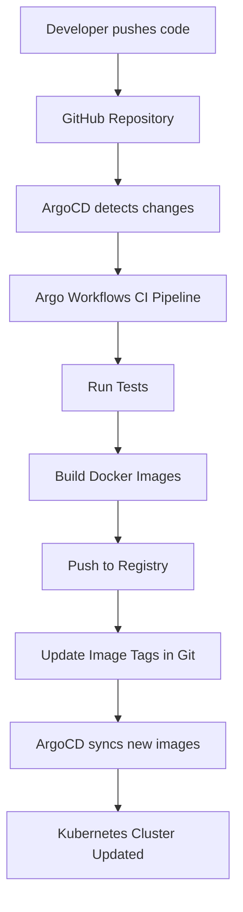

# GitOps Workflow for Transcripts v2

This document explains the complete GitOps workflow for the Transcripts v2 project.

## GitOps Architecture



## Components

### 1. ArgoCD - Continuous Deployment
- **Purpose**: Monitors Git repository and syncs changes to Kubernetes
- **Applications**:
  - `transcripts-infrastructure`: Manages core infrastructure (MinIO, PostgreSQL, Registry, etc.)
  - `transcripts-services`: Manages API services (Gateway, Transcription, etc.)
- **Auto-sync**: Enabled with `prune` and `selfHeal`
- **Location**: `deploy/kubernetes/base/gitops/argocd-applications.yaml`

### 2. Argo Workflows - CI/CD Pipeline
- **Purpose**: Automated build, test, and deployment pipeline
- **Triggers**: Manual, scheduled (nightly), or webhook-based
- **Steps**:
  1. Git checkout
  2. Run tests
  3. Build Docker images (parallel)
  4. Push to local registry
  5. Update image tags in Git
- **Location**: `deploy/kubernetes/base/gitops/ci-workflow.yaml`

### 3. ArgoCD Image Updater
- **Purpose**: Automatically updates image tags when new images are pushed
- **Monitors**: Local Docker registry for new image tags
- **Updates**: Kustomization files with new image references
- **Location**: `deploy/kubernetes/base/gitops/image-updater.yaml`

### 4. Local Docker Registry
- **Purpose**: Stores container images within the cluster
- **Internal DNS**: `docker-registry.infrastructure.svc.cluster.local:5000`
- **External Access**: `localhost:30500` (NodePort for pushing)

## GitOps Workflow

### Automatic Workflow (Full GitOps)
1. **Code Change**: Developer pushes to `migration-to-modularity` branch
2. **Detection**: ArgoCD detects changes in Git repository
3. **CI Pipeline**: Argo Workflows automatically triggers CI pipeline
4. **Testing**: Runs automated tests
5. **Building**: Builds new Docker images for changed services
6. **Registry**: Pushes images to local registry
7. **Image Update**: ArgoCD Image Updater detects new images
8. **Manifest Update**: Updates Kubernetes manifests with new image tags
9. **Deployment**: ArgoCD syncs updated manifests to cluster
10. **Verification**: Health checks ensure deployment success

### Manual Workflow (Current)
1. **Build Images**: `./build-images.sh`
2. **Deploy**: `kubectl apply -k environments/local`

## Repository Structure for GitOps

```
deploy/kubernetes/
├── base/                          # Base configurations
│   ├── infrastructure/            # Core infrastructure
│   ├── services/                  # API services
│   ├── gitops/                    # GitOps configurations
│   └── kustomization.yaml         # Base kustomization
├── environments/                  # Environment overlays
│   ├── local/                     # Local development
│   ├── staging/                   # Staging environment
│   └── production/                # Production environment
└── gitops/                        # GitOps specific files
    ├── applications/              # ArgoCD Applications
    ├── workflows/                 # Argo Workflows
    └── image-updater/            # Image updater configs
```

## Configuration

### ArgoCD Applications

**Infrastructure Application:**
- **Source**: `deploy/kubernetes/base/infrastructure`
- **Destination**: `infrastructure` namespace
- **Sync Policy**: Automated with prune and self-heal

**Services Application:**
- **Source**: `deploy/kubernetes/environments/local`
- **Destination**: `endpoints` namespace
- **Sync Policy**: Automated with prune and self-heal
- **Ignore Differences**: Image tags (handled by Image Updater)

### CI/CD Pipeline Parameters

| Parameter | Value | Description |
|-----------|--------|-------------|
| `git-repo` | `https://github.com/your-org/transcripts.git` | Source repository |
| `git-revision` | `migration-to-modularity` | Branch to build from |
| `registry` | `docker-registry.infrastructure.svc.cluster.local:5000` | Target registry |
| `image-tag` | `{{workflow.creationTimestamp}}` | Unique tag per build |

### Image Update Annotations

Services that should be auto-updated need these annotations:

```yaml
metadata:
  annotations:
    argocd-image-updater.argoproj.io/image-list: |
      service-name=docker-registry.infrastructure.svc.cluster.local:5000/transcripts/service-name:latest
    argocd-image-updater.argoproj.io/write-back-method: git
```

## Setup Instructions

### 1. Enable GitOps (One-time setup)

```bash
# Deploy base infrastructure including GitOps components
kubectl apply -k deploy/kubernetes/base

# Wait for ArgoCD to be ready
kubectl wait --for=condition=Ready pods -l app.kubernetes.io/name=argocd-server -n argocd --timeout=300s

# Get ArgoCD admin password
kubectl -n argocd get secret argocd-initial-admin-secret -o jsonpath="{.data.password}" | base64 -d
```

### 2. Configure Repository Access

```bash
# Add your Git repository to ArgoCD
argocd login localhost:8080
argocd repo add https://github.com/your-org/transcripts.git
```

### 3. Create Applications

```bash
# Apply ArgoCD Applications
kubectl apply -f deploy/kubernetes/base/gitops/argocd-applications.yaml
```

### 4. Verify GitOps Setup

```bash
# Check ArgoCD applications
kubectl get applications -n argocd

# Check Argo Workflows
kubectl get workflows -n argo-workflows

# Check Image Updater
kubectl logs -n argocd deployment/argocd-image-updater
```

## Triggering Builds

### Manual Build
```bash
# Trigger workflow manually
argo submit -n argo-workflows deploy/kubernetes/base/gitops/ci-workflow.yaml
```

### Webhook-based Build (Future)
Set up GitHub webhooks to trigger workflows on push:
```bash
# Example webhook URL (when exposed)
curl -X POST http://argo-workflows.local/api/v1/workflows/argo-workflows \
  -H "Content-Type: application/json" \
  -d '{"resourceKind":"WorkflowTemplate","resourceName":"transcripts-ci-pipeline"}'
```

### Scheduled Build
Nightly builds are automatically configured via CronWorkflow:
- **Schedule**: Daily at 2 AM
- **Template**: `transcripts-ci-pipeline`

## Monitoring GitOps

### ArgoCD UI
- **URL**: http://localhost:30080 (or port-forward)
- **Features**: Application status, sync history, resource tree
- **Health**: Green = synced, Yellow = progressing, Red = failed

### Argo Workflows UI  
- **URL**: http://localhost:30746 (or port-forward)
- **Features**: Workflow status, logs, artifacts
- **Monitoring**: Build success/failure, execution time

### Image Updater Logs
```bash
kubectl logs -n argocd deployment/argocd-image-updater -f
```

## Troubleshooting

### Common Issues

1. **Applications not syncing**
   ```bash
   # Check ArgoCD application status
   kubectl describe application transcripts-services -n argocd
   
   # Force sync
   argocd app sync transcripts-services
   ```

2. **Workflow failures**
   ```bash
   # Check workflow logs
   argo logs -n argo-workflows <workflow-name>
   
   # Debug failed step
   kubectl logs -n argo-workflows <pod-name> -c <container-name>
   ```

3. **Image update failures**
   ```bash
   # Check image updater logs
   kubectl logs -n argocd deployment/argocd-image-updater
   
   # Verify registry connectivity
   kubectl exec -n argocd deployment/argocd-image-updater -- curl http://docker-registry.infrastructure.svc.cluster.local:5000/v2/_catalog
   ```

### Recovery Procedures

1. **Reset ArgoCD Applications**
   ```bash
   argocd app delete transcripts-services
   kubectl apply -f deploy/kubernetes/base/gitops/argocd-applications.yaml
   ```

2. **Clean Failed Workflows**
   ```bash
   argo delete -n argo-workflows --all
   ```

3. **Registry Issues**
   ```bash
   kubectl delete -n infrastructure deployment/docker-registry
   kubectl apply -k deploy/kubernetes/base/infrastructure/registry
   ```

## Migration Path

### Phase 1: Manual (Current)
- Manual image builds
- Manual deployments
- ArgoCD for monitoring only

### Phase 2: Semi-Automated  
- Manual triggers for CI/CD
- Automated image updates
- ArgoCD handles deployments

### Phase 3: Full GitOps
- Webhook-triggered builds
- Automatic image updates
- Complete Git-driven deployments
- Multi-environment support

## Security Considerations

1. **Registry Access**: Uses cluster-internal registry (no external exposure)
2. **Git Credentials**: Store in Kubernetes secrets
3. **ArgoCD RBAC**: Project-based access control
4. **Workflow Permissions**: Minimal required permissions
5. **Image Scanning**: Add to CI pipeline (future enhancement)

This GitOps setup provides a production-ready continuous deployment pipeline while maintaining the flexibility to operate manually during development.